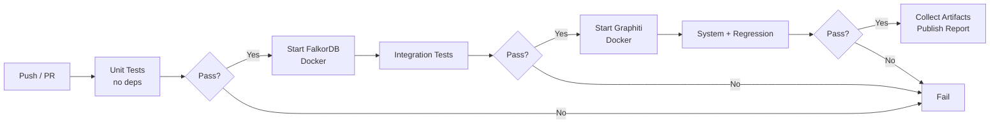

# Context Overhaul — Test Plan

**Status:** Draft (planned automation not yet implemented) **Date:** 2026-03-14
**Canonical design:** [`plans/ContextOverhaul.md`](plans/ContextOverhaul.md)

> **Note:** This document outlines the _intended_ test strategy. The test
> infrastructure (Docker Compose fixtures, baseline files, deno task runner) is
> not yet in the repo. Current runnable tasks:
> `deno task build|deploy|dev|check|lint|fmt`. Full automation is aspirational.

---

## 1 Purpose

Verify that the Context Overhaul implementation delivers on its four core
promises:

1. **Zero Graphiti on the hot path** — no synchronous MCP/Graphiti call blocks
   any hook return.
2. **High-quality session continuity** — compact `session_memory` envelopes
   restore task state, decisions, files, and rules after compaction or restart.
3. **High-quality cross-session persistent memory** — `persistent_memory`
   surfaces relevant project-bound facts from the Graphiti cache without noise.
4. **Graceful degradation** — the plugin remains functional when Redis or
   Graphiti is unavailable.

Secondary goals:

- Confirm the implementation avoids legacy verbose `<memory data-uuids="...">`
  hot-path injection.
- Confirm context payloads stay within budget and do not regress in size or
  latency.
- Produce CI-friendly artifacts (timing logs, payload snapshots, pass/fail exit
  codes).

---

## 2 Non-Goals / Scope Boundaries

- [ ] **Not testing Graphiti internals** — entity extraction quality, vector
      search recall, or FalkorDB query plans are out of scope.
- [ ] **Not testing OpenCode core** — compaction summarizer quality, hook
      dispatch ordering, or provider prefix caching are assumed correct.
- [ ] **Not testing MCP protocol compliance** — the MCP transport layer is
      covered by `ConnectionManager` tests.
- [ ] **Not benchmarking LLM output quality** — we test structural properties of
      injected context, not whether the LLM "understands" it.
- [ ] **Not covering UI/UX** — no visual or interactive-shell UX assertions.

---

## 3 Test Environment / Dependencies

### 3.1 Required Services

| Service  | Purpose                     | Test mode                                                  |
| -------- | --------------------------- | ---------------------------------------------------------- |
| FalkorDB | Redis-protocol hot tier     | Real instance (Docker) or `MockRedisClient` for unit tests |
| Graphiti | Async consolidation backend | Real MCP endpoint or stub/mock for isolation tests         |
| Deno     | Runtime                     | `deno test` with `--allow-net --allow-env`                 |

### 3.2 Test Tiers

| Tier        | Scope                       | External deps | Speed   |
| ----------- | --------------------------- | ------------- | ------- |
| Unit        | Pure functions, extractors  | None (mocks)  | < 5 s   |
| Integration | Redis read/write, MCP calls | FalkorDB      | < 30 s  |
| System      | Full hook lifecycle         | Both services | < 120 s |
| Regression  | Size/latency budgets        | Both services | < 60 s  |

### 3.3 CI Matrix

```yaml
# Suggested GitHub Actions matrix
strategy:
  matrix:
    tier: [unit, integration, system, regression]
    redis: [real, mock]
    graphiti: [real, stub]
    exclude:
      - tier: unit
        redis: real
      - tier: unit
        graphiti: real
```

---

## 4 Required Fixtures and Seeded Memory Data

### 4.1 Redis Fixtures

| Fixture key                    | Content                                                       | Used by suites                   |
| ------------------------------ | ------------------------------------------------------------- | -------------------------------- |
| `session:test-1:events`        | 15 `SessionEvent` objects spanning all `EventCategory` values | Continuity, compaction, snapshot |
| `session:test-1:snapshot`      | Pre-built priority-tiered XML snapshot (< 3 KB)               | Compaction, restart/recovery     |
| `memory-cache:test-group`      | Serialized Graphiti search results (3 facts, 2 nodes)         | Persistent memory, drift refresh |
| `memory-cache:test-group:meta` | `lastQuery`, `lastRefresh`, `factUuids` hash                  | Drift detection, staleness       |
| `drain:pending:test-group`     | 5 serialized drain-batch entries                              | Drain, crash recovery            |
| `drain:cursor:test-group`      | Event ID of last drained event                                | Drain resume                     |

### 4.2 Graphiti Stub Responses

| MCP tool call         | Stub response                                                          |
| --------------------- | ---------------------------------------------------------------------- |
| `search_memory_facts` | 3 facts with UUIDs, validity dates, and relevance scores               |
| `search_nodes`        | 2 entity nodes with summaries                                          |
| `get_episodes`        | 1 recent session snapshot episode                                      |
| `add_memory`          | Success acknowledgment (or configurable failure for degradation tests) |
| `get_status`          | Health OK (or configurable timeout/error)                              |

### 4.3 Legacy Fixture

A message array containing a
`<memory data-uuids="fact-legacy-1,fact-legacy-2">verbose block...</memory>`
part, used to verify migration/compatibility behavior.

---

## 5 Observability / Instrumentation

Tests must capture and assert on the following observable signals:

### 5.1 Timing

- [ ] Wall-clock time of every hook return (`chat.message`,
      `messages.transform`, `session.compacting`).
- [ ] Async operation durations (drain batch, cache refresh) logged but not on
      the critical path.

### 5.2 Payload Snapshots

- [ ] Serialized `session_memory` envelope captured as a CI artifact on every
      injection.
- [ ] Snapshot XML captured on every `session.idle` and `session.compacted`
      event.
- [ ] Byte size of each injected payload recorded for regression tracking.

### 5.3 Structured Logs

- [ ] All Redis reads/writes logged with key name and byte size.
- [ ] All async MCP calls logged with tool name, duration, and success/failure.
- [ ] Drift detection decisions logged with Jaccard score and refresh trigger.

### 5.4 CI Artifact Collection

```
artifacts/
  timing-report.json       # per-hook wall-clock times
  payload-snapshots/       # serialized XML/envelope per test case
  size-regression.csv      # payload byte sizes across runs
  coverage-report/         # deno test --coverage output
```

---

## 6 Test Suites

### Suite A: Hot-Path No-Graphiti Guarantee

**Goal:** Prove that no synchronous Graphiti/MCP call occurs during any hot-path
hook.

**Tier:** Unit + Integration

**Method:** Instrument the MCP client with a call counter. Assert the counter is
zero after each hot-path hook completes.

#### Checklist

- [ ] A-1: `chat.message` handler completes without any MCP `callTool`
      invocation.
- [ ] A-2: `experimental.chat.messages.transform` completes without any MCP
      `callTool` invocation.
- [ ] A-3: `experimental.session.compacting` completes without any MCP
      `callTool` invocation.
- [ ] A-4: `event: message.updated` handler completes without any MCP `callTool`
      invocation.
- [ ] A-5: `event: session.compacted` synchronous portion completes without any
      MCP `callTool` invocation.
- [ ] A-6: `event: session.idle` synchronous portion completes without any MCP
      `callTool` invocation.
- [ ] A-7: All hot-path hooks return within 5 ms when Redis is available
      (wall-clock assertion).
- [ ] A-8: Async MCP calls (drain, cache refresh) are confirmed to fire _after_
      the hook returns, via event ordering in the log.

**Automation:** Fully automatable with mock MCP client and `MockRedisClient`.

---

### Suite B: Compact Memory Payloads

**Goal:** Verify injected `session_memory` envelopes are compact, structured,
and within budget.

**Tier:** Unit

#### Checklist

- [ ] B-1: `session_memory` envelope byte size is <= 2 400 chars (1 600 session
      guide + 800 snapshot).
- [ ] B-2: `persistent_memory` section, when present, fits within the remainder
      of the 5% context budget.
- [ ] B-3: Total injected payload (session + persistent) does not exceed 5% of a
      128k-token model context (≈ 25 600 chars).
- [ ] B-4: Snapshot XML conforms to the priority-tiered schema from
      `ContextOverhaul.md` §4.3.
- [ ] B-5: Snapshot respects the 3 KB budget — lower-priority sections are
      truncated first.
- [ ] B-6: Each `session_memory` always contains `last_request`; list sections
      (`active_tasks`, `key_decisions`, `files_in_play`, `project_rules`) are
      present only when they have content and are omitted when empty.
- [ ] B-7: Optional sections (`unresolved_errors`, `git_state`, `subagent_work`,
      `session_snapshot`, `persistent_memory`) appear only when source data
      exists.
- [ ] B-8: No raw tool output, raw transcript text, or multi-KB body content
      appears in the injected envelope.

**Automation:** Fully automatable — parse XML, measure byte sizes, assert
structure.

---

### Suite C: No Raw Tool/Transcript Dumps in Hot-Tier State

**Goal:** Confirm the implementation follows the context-mode strategy of
capturing structured events rather than raw transcripts.

**Tier:** Unit

#### Checklist

- [ ] C-1: `SessionEvent.body` field is truncated to <= 4 KB per the schema.
- [ ] C-2: Events extracted from tool-result messages store a summary (≤ 200
      chars) and metadata, not the full tool output.
- [ ] C-3: `session:{id}:events` list entries do not contain raw assistant
      message text longer than the `body` limit.
- [ ] C-4: The priority-tiered snapshot contains no raw tool output — only
      summaries, file paths, and structured state.
- [ ] C-5: Compaction context (`session.compacting` output) contains no raw
      transcript replay — only the canonical `session_memory` envelope.
- [ ] C-6: `memory-cache:{groupId}` stores parsed/structured Graphiti results,
      not raw MCP response JSON.

**Automation:** Fully automatable — inspect serialized Redis values and hook
outputs.

---

### Suite D: Session Continuity Quality

**Goal:** Verify that within a single session, the injected context accurately
reflects the conversation state.

**Tier:** Integration

#### Checklist

- [ ] D-1: After 5 user/assistant exchanges, `session_memory` reflects the
      current task, recent decisions, and touched files.
- [ ] D-2: After a user correction ("actually, use X instead of Y"), the next
      `session_memory` includes the correction in `key_decisions`.
- [ ] D-3: After a file edit event, `files_in_play` lists the edited file.
- [ ] D-4: After an error event, `unresolved_errors` appears in the envelope.
- [ ] D-5: After the error is resolved, `unresolved_errors` is removed from
      subsequent envelopes.
- [ ] D-6: `last_request` always reflects the most recent user message intent,
      not a stale prior message.
- [ ] D-7: Session events are ordered chronologically in Redis (`LRANGE` returns
      FIFO order).
- [ ] D-8: The `session_memory` envelope is idempotent — calling
      `prepareInjection` twice with the same state produces identical output.

**Automation:** Automatable with simulated hook sequences against
`MockRedisClient`.

---

### Suite E: Compaction Continuity

**Goal:** Verify that context survives compaction with no loss of critical
state.

**Tier:** Integration

#### Checklist

- [ ] E-1: `session.compacting` hook injects a `session_memory` envelope into
      `output.context`.
- [ ] E-2: The compaction-injected envelope contains the same required sections
      as chat-time injection (B-6).
- [ ] E-3: After `session.compacted` fires, a new snapshot is built from
      surviving events and stored in Redis.
- [ ] E-4: The post-compaction snapshot preserves P0 content (decisions,
      constraints, active task) even when lower-priority sections are truncated.
- [ ] E-5: A `chat.message` arriving after compaction produces a
      `session_memory` that includes the post-compaction snapshot.
- [ ] E-6: Compaction summary is enqueued to `drain:pending:{groupId}` for async
      Graphiti ingestion.
- [ ] E-7: Multiple sequential compactions do not cause snapshot drift — each
      rebuild uses the current event list.
- [ ] E-8: Compaction with an empty `memory-cache` (cold Graphiti) still
      produces a valid `session_memory` and omits `<persistent_memory>`.

**Automation:** Automatable with simulated compaction lifecycle against mocks.

---

### Suite F: Cross-Session Project-Bound Persistent Memory

**Goal:** Verify that `persistent_memory` surfaces relevant project-scoped facts
from the Graphiti cache and that cross-session recall works.

**Tier:** Integration + System

#### Checklist

- [ ] F-1: On a new session with a warm `memory-cache:{groupId}`, the first
      `messages.transform` includes `persistent_memory` with cached facts.
- [ ] F-2: On a new session with a cold cache, the first turn omits
      `persistent_memory`; subsequent turns include it after async warmup
      completes.
- [ ] F-3: `persistent_memory` omits legacy `fact_uuids`; the emitted shape uses
      `node_refs` only.
- [ ] F-4: Facts from a different `groupId` (different project) do not appear in
      `persistent_memory`.
- [ ] F-5: Stale facts (older than `factStaleDays`) are annotated or filtered
      per configuration.
- [ ] F-6: `persistent_memory` content is a structured summary, not raw Graphiti
      JSON.
- [ ] F-7: After draining events to Graphiti and refreshing the cache, newly
      created fact/node summaries appear in `persistent_memory` on subsequent
      sessions.
- [ ] F-8: The `node_refs` attribute in `persistent_memory` lists entity node
      references when present.

**Automation:** F-1 through F-6 automatable with mocks. F-7 requires a real
Graphiti endpoint (system tier). F-8 automatable with stub responses.

---

### Suite G: Memory Relevance / Anti-Noise

**Goal:** Confirm that injected memory is relevant to the current conversation
and does not include noise.

**Tier:** Unit + Integration

#### Checklist

- [ ] G-1: When the user asks about "Redis configuration", `persistent_memory`
      does not include facts about unrelated topics (e.g., "CSS styling
      preferences").
- [ ] G-2: Duplicate facts (same UUID) are never injected twice in a single
      envelope.
- [ ] G-3: The `visibleFactUuids` tracking prevents re-injection of
      already-visible facts within the same session.
- [ ] G-4: `persistent_memory` respects the budget remainder — it does not crowd
      out `session_memory` core sections.
- [ ] G-5: When cached persistent memory has zero relevant results,
      `persistent_memory` is omitted entirely (not rendered as an empty tag).
- [ ] G-6: The legacy `<memory data-uuids>` block is never emitted by the new
      implementation — only `<session_memory>` with optional
      `<persistent_memory>`.

**Automation:** G-1 requires semantic evaluation (semi-automated with keyword
matching on stub data). G-2 through G-6 fully automatable.

---

### Suite H: Drift Refresh Behavior

**Goal:** Verify that topic drift triggers an async cache refresh and that the
refreshed cache is used on the next turn.

**Tier:** Integration

#### Checklist

- [ ] H-1: When Jaccard similarity between current query text and cached query
      text drops below `driftThreshold`, an async cache refresh is scheduled.
- [ ] H-2: The current (stale) cache is still injected on the drift-triggering
      message (one-message staleness tradeoff).
- [ ] H-3: On the next `chat.message` after the refresh completes, the updated
      cache is injected.
- [ ] H-4: When Jaccard similarity is above `driftThreshold`, no refresh is
      scheduled.
- [ ] H-5: Drift detection uses the cached query metadata in
      `memory-cache:{groupId}:meta`, not a live Graphiti query.
- [ ] H-6: Rapid successive messages with different topics do not cause
      thundering-herd refresh calls — only one refresh is in flight per group at
      a time, with newer queries picked up after the in-flight refresh settles.

**Automation:** Fully automatable with mock MCP client tracking call counts and
timing.

---

### Suite I: Restart / Recovery Behavior

**Goal:** Verify that plugin restart recovers state from Redis and resumes
normal operation.

**Tier:** Integration

#### Checklist

- [ ] I-1: After plugin restart, `drain:pending:{groupId}` is read and pending
      events are re-drained.
- [ ] I-2: After plugin restart, `drain:cursor:{groupId}` is read and only
      events after the cursor are drained.
- [ ] I-3: After plugin restart, `session:{id}:snapshot` is available for the
      next session's compaction context.
- [ ] I-4: Duplicate drain (events re-sent due to cursor not advancing) is
      handled idempotently by Graphiti (UUID-keyed).
- [ ] I-5: After plugin restart with Redis available but Graphiti down, the
      plugin operates in degraded mode (session continuity works, drain queues
      up).
- [ ] I-6: TTL expiry of session keys (24h for events, 48h for snapshots) does
      not cause errors — the plugin handles missing keys gracefully.
- [ ] I-7: `memory-cache:{groupId}` TTL expiry (10 min) results in omitted
      `persistent_memory`, not an error.

**Automation:** Automatable by resetting plugin state and re-initializing
against pre-seeded Redis fixtures.

---

### Suite J: Redis Outage / Graphiti Outage Degradation

**Goal:** Verify graceful degradation when one or both backends are unavailable.

**Tier:** Integration + System

#### Checklist

- [ ] J-1: **Redis down at startup:** plugin logs error, falls back to in-memory
      event buffer, hooks still fire.
- [ ] J-2: **Redis down at startup:** `session_memory` is still produced from
      in-memory state (degraded but functional).
- [ ] J-3: **Redis down mid-session:** ioredis auto-reconnect fires; events
      buffered in memory during outage.
- [ ] J-4: **Redis down mid-session:** after reconnect, state rebuilds and
      subsequent hooks use Redis again.
- [ ] J-5: **Graphiti down at startup:** plugin logs warning, continues;
      `persistent_memory` is omitted.
- [ ] J-6: **Graphiti down mid-session:** drain retries with exponential
      backoff; cache stales out after TTL.
- [ ] J-7: **Graphiti down mid-session:** `session_memory` (Redis-sourced) is
      unaffected.
- [ ] J-8: **Both down:** plugin operates with in-memory buffer only; equivalent
      to no-plugin-at-all baseline.
- [ ] J-9: **Graphiti returns after outage:** drain resumes; cache refreshes on
      next trigger.
- [ ] J-10: **Redis returns after outage:** state rebuilds; no duplicate events
      from the in-memory buffer period.
- [ ] J-11: Dead-letter batches (`drain:dead:{groupId}`) are created after 3
      failed drain attempts.
- [ ] J-12: No hook throws an unhandled exception during any outage scenario —
      all failures are caught and logged.

**Automation:** J-1 through J-8 automatable by controlling mock service
availability. J-9, J-10 require timed reconnection simulation. J-11, J-12 fully
automatable.

---

### Suite K: Context-Size / Latency Regression Detection

**Goal:** Detect regressions in injected payload size and hook latency across
commits.

**Tier:** Regression

#### Checklist

- [ ] K-1: `session_memory` envelope byte size is recorded per test run and
      compared against a baseline.
- [ ] K-2: A > 20% increase in envelope size from baseline fails the regression
      check.
- [ ] K-3: `chat.message` hook wall-clock time is recorded and compared against
      a 5 ms threshold (Redis available).
- [ ] K-4: `messages.transform` hook wall-clock time is recorded and compared
      against a 3 ms threshold.
- [ ] K-5: `session.compacting` hook wall-clock time is recorded and compared
      against a 5 ms threshold.
- [ ] K-6: Async drain batch duration is recorded (informational, no hard
      threshold — Graphiti latency varies).
- [ ] K-7: Payload size CSV is published as a CI artifact for trend analysis.
- [ ] K-8: Latency percentiles (p50, p95, p99) are computed over 100 iterations
      of each hook.

**Automation:** Fully automatable once a baseline file
(`tests/baselines/payload-sizes.json`) is created and checked into the repo
(proposed infrastructure).

---

### Suite L: Migration / Compatibility — Legacy `data-uuids`

**Goal:** Verify that the new implementation correctly handles legacy
`<memory data-uuids="...">` blocks and does not emit them.

**Tier:** Unit

#### Checklist

- [ ] L-1: The `messages.transform` handler extracts `fact_uuids` from legacy
      `<memory data-uuids="...">` blocks found in existing message history.
- [ ] L-2: Extracted legacy UUIDs are added to `visibleFactUuids` to prevent
      re-injection.
- [ ] L-3: The new implementation never emits a `<memory data-uuids="...">`
      block — only `<session_memory>` with `<persistent_memory>`.
- [ ] L-4: A message array containing both legacy `<memory data-uuids>` and new
      `<session_memory>` blocks is handled without errors.
- [ ] L-5: Legacy `data-uuids` remain parse-only compatibility input;
      `<persistent_memory>` itself emits `node_refs` only.
- [ ] L-6: Legacy config keys (`endpoint`, `groupIdPrefix`, `driftThreshold`) at
      the top level are resolved correctly when nested `graphiti.*` keys are
      absent.
- [ ] L-7: When both legacy top-level and nested config keys are present, nested
      values take precedence.
- [ ] L-8: No verbose multi-paragraph memory block (characteristic of the legacy
      Graphiti injection) appears in any hot-path output.

**Automation:** Fully automatable — existing test in `messages.test.ts` already
covers L-1/L-2 partially.

---

### Suite M: Child / Subagent Session Routing

**Goal:** Verify that child/subagent sessions are resolved to the canonical root
session and that their activity flows through the same memory pipeline as the
parent.

**Tier:** Unit + Integration

**Canonical design reference:** `plans/ContextOverhaul.md` §10.1

**Divergence note:** This behavior intentionally differs from official
`mksglu/context-mode`, which treats subagent work as summarized tool events
rather than first-class session participants. See §10.1 of the design doc for
the rationale and alignment guidance.

#### Checklist

- [x] M-1: `session.created` with a `parentID` caches the parent/child linkage
      and resolves the canonical (root) session ID.
- [x] M-2: `chat.message` from a child session records events under the
      canonical root session's `session:{canonicalId}:events` key.
- [x] M-3: `experimental.chat.messages.transform` from a child session injects
      the root session's `<session_memory>` envelope.
- [x] M-4: `experimental.session.compacting` from a child session uses the root
      session's state and snapshot.
- [x] M-5: `message.updated` from a child session finalizes the assistant
      message under the canonical root session.
- [x] M-6: `message.part.updated` from a child session buffers assistant text
      under the canonical root session ID.
- [x] M-7: `session.deleted` for a child session removes only the child's local
      bookkeeping (parent-ID cache, canonical-ID cache, buffered messages) and
      does **not** delete the root session's state, events, or snapshot.
- [x] M-8: Child-derived events appear in the priority-tiered snapshot when it
      is rebuilt at `session.idle` or `session.compacted`.
- [x] M-9: Future `<session_memory>` injections for the parent session include
      events that originated from child sessions.
- [x] M-10: Canonical ID resolution handles multi-level nesting (grandchild →
      child → root) and detects cycles without infinite loops.

**Automation:** Fully automatable with mock SDK client and `MockRedisClient`.
Tests exist in `event.test.ts`, `chat.test.ts`, `messages.test.ts`,
`compacting.test.ts`, and `session-snapshot.test.ts`.

---

## 7 Metrics and Thresholds

| Metric                                 | Threshold              | Source                 | Action on breach     |
| -------------------------------------- | ---------------------- | ---------------------- | -------------------- |
| Hot-path hook wall-clock (p95)         | < 5 ms (Redis up)      | Timing instrumentation | Fail CI              |
| `session_memory` envelope size         | <= 2 400 chars         | Payload snapshot       | Fail CI              |
| Total injected payload size            | <= 5% of context limit | Payload snapshot       | Fail CI              |
| Snapshot XML size                      | <= 3 072 bytes (3 KB)  | Redis `GET`            | Fail CI              |
| `SessionEvent.summary` length          | <= 200 chars           | Event extractor output | Fail CI              |
| `SessionEvent.body` length             | <= 4 096 bytes (4 KB)  | Event extractor output | Fail CI              |
| Async drain batch duration (p95)       | < 5 000 ms             | Async timing log       | Warn (informational) |
| Cache refresh duration (p95)           | < 2 000 ms             | Async timing log       | Warn (informational) |
| MCP calls during hot-path hooks        | 0                      | Call counter           | Fail CI              |
| Payload size regression (vs. baseline) | < 20% increase         | Size regression CSV    | Fail CI              |
| Dead-letter batches per session        | 0 (healthy run)        | Redis key count        | Warn (informational) |

---

## 8 Pass / Fail Criteria

### 8.1 Overall Pass

All of the following must be true:

- [ ] All Suite A checks pass (zero Graphiti on hot path).
- [ ] All Suite B checks pass (compact payloads within budget).
- [ ] All Suite C checks pass (no raw tool/transcript dumps).
- [ ] All Suite L checks pass (no legacy `data-uuids` emission).
- [ ] All Suite K thresholds are within bounds (no regressions).
- [ ] No unhandled exceptions in any degradation scenario (Suite J-12).
- [ ] Test coverage for hot-path code paths >= 90%.

### 8.2 Conditional Pass (with known gaps)

The following suites may have items that require manual verification or a real
interactive shell lifecycle:

- Suite D (session continuity quality) — D-1 through D-5 require multi-turn
  simulation.
- Suite F (cross-session persistent memory) — F-7 requires real Graphiti.
- Suite J (degradation) — J-9, J-10 require timed reconnection.

These items are tracked as known gaps (see §10) and do not block CI pass if the
automatable subset passes.

### 8.3 Fail

Any of the following triggers a fail:

- Any MCP call detected during a hot-path hook (Suite A).
- Injected payload exceeds budget (Suite B, K).
- Legacy `<memory data-uuids>` block emitted by new code (Suite L-3).
- Unhandled exception during degradation (Suite J-12).
- Hot-path hook latency exceeds 5 ms p95 (Suite K-3 through K-5).

---

## 9 CI/CD Automation Strategy (Proposed)

> **Status:** Not yet implemented. The following sections describe the
> _intended_ CI/CD flow. Docker Compose fixtures (`tests/docker-compose.yml`)
> and baseline files (`tests/baselines/payload-sizes.json`) do not yet exist.
> Current runnable tasks available in `deno.json`: `build`, `deploy`, `dev`,
> `check`, `lint`, `fmt`.

### 9.1 Test Execution (Proposed)

```bash
# Unit tests (no external deps)
deno test --allow-env --filter "suite-[a-c,g,l]" src/

# Integration tests (requires FalkorDB)
docker compose -f tests/docker-compose.yml up -d falkordb
deno test --allow-net --allow-env --filter "suite-[d-f,h-j]" src/

# Regression tests (requires both services)
docker compose -f tests/docker-compose.yml up -d
deno test --allow-net --allow-env --filter "suite-k" src/

# Full run
docker compose -f tests/docker-compose.yml up -d
deno test --allow-net --allow-env src/
```

### 9.2 CI Artifacts to Collect

| Artifact                  | Format | Purpose                                   |
| ------------------------- | ------ | ----------------------------------------- |
| `timing-report.json`      | JSON   | Per-hook latency data for trend analysis  |
| `payload-snapshots/*.xml` | XML    | Injected envelopes for manual review      |
| `size-regression.csv`     | CSV    | Payload sizes for cross-commit comparison |
| `coverage-report/`        | HTML   | Deno test coverage output                 |
| `test-results.json`       | JSON   | Structured pass/fail per checklist item   |
| `dead-letter-report.json` | JSON   | Dead-letter batches created during run    |

### 9.3 Suggested CI Pipeline



### 9.4 Baseline Management (Proposed)

- Payload size baselines _would be_ stored in
  `tests/baselines/payload-sizes.json` (file does not yet exist).
- Baselines _would be_ updated manually via `deno task update-baselines` (task
  not yet available) after intentional size changes.
- CI _would_ compare current sizes against the checked-in baseline and fail on >
  20% regression once infrastructure is available.

---

## 10 Remaining Gaps / Hard-to-Automate Tests

### 10.1 Tests Requiring a True Interactive Shell Lifecycle

The following tests cannot be fully automated within the current OpenCode plugin
test harness because they require a real OpenCode session lifecycle (hook
dispatch, compaction trigger, multi-turn LLM interaction):

| Test ID | Description                                 | Approximation strategy                                                           |
| ------- | ------------------------------------------- | -------------------------------------------------------------------------------- |
| D-1     | Multi-turn continuity after 5 exchanges     | Simulate by calling hook handlers sequentially with synthetic payloads.          |
| D-2     | User correction reflected in next injection | Simulate with synthetic `decision` event insertion.                              |
| E-5     | Post-compaction chat uses new snapshot      | Simulate by calling compaction handler then chat handler in sequence.            |
| F-2     | Cold-start first turn, warm second turn     | Simulate with timed async warmup and sequential handler calls.                   |
| F-7     | Cross-session fact recall after drain       | Requires real Graphiti; approximate with stub that returns pre-seeded facts.     |
| J-9     | Graphiti recovery triggers drain resume     | Simulate by toggling mock MCP availability and advancing timers.                 |
| J-10    | Redis recovery rebuilds state               | Simulate by toggling mock Redis availability and verifying event list integrity. |

### 10.2 Tests Requiring Real Services

| Test ID | Description                             | Why                                                            |
| ------- | --------------------------------------- | -------------------------------------------------------------- |
| F-7     | End-to-end cross-session recall         | Needs real Graphiti entity extraction and vector search.       |
| K-6     | Async drain batch duration              | Meaningful only against real Graphiti (LLM-backed extraction). |
| K-8     | Latency percentiles over 100 iterations | Meaningful only against real services under realistic load.    |

### 10.3 Tests Requiring Manual / Exploratory Verification

| Area                          | What to verify                                                                                   |
| ----------------------------- | ------------------------------------------------------------------------------------------------ |
| LLM continuity quality        | Does the LLM actually "feel" continuous after compaction? Requires human judgment.               |
| Memory relevance (semantic)   | Are the right facts surfaced for a given topic? Keyword matching approximates.                   |
| Multi-agent orchestration     | Subagent events in a real swarm session. Unit-level child-session routing is covered by Suite M. |
| Long-running session (> 1 hr) | TTL expiry, cache staleness, and drift behavior over extended use.                               |

### 10.4 OpenCode Shell Model Limitations

The current OpenCode plugin architecture has these constraints for test
automation:

1. **No programmatic session creation** — tests cannot create a real OpenCode
   session; they must simulate hook calls.
2. **No compaction trigger API** — compaction is triggered by OpenCode
   internally; tests simulate `session.compacting` and `session.compacted`
   events.
3. **No multi-session orchestration** — testing cross-session behavior requires
   separate test runs or simulated session boundaries.
4. **Hook dispatch is synchronous in tests** — async fire-and-forget behavior
   must be verified by awaiting explicit flush/drain calls rather than relying
   on event-loop timing.

**Mitigation:** The test harness simulates the hook lifecycle by calling handler
functions directly with synthetic inputs. This covers ~85% of the test plan. The
remaining ~15% (marked in §10.1–10.3) requires either real services, real
OpenCode sessions, or human judgment.
